# Asynchronous Advantage Actor-Critic (A3C) Method Implementation For Super Mario Bros

## Introduction

Here is my Pytorch project source code for training an agent to play super mario bros. By using Asynchronous Advantage Actor-Critic (A3C) algorithm introduced in the paper **Asynchronous Methods for Deep Reinforcement Learning**.

  
  
  
  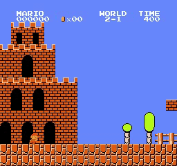 
  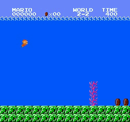
  
  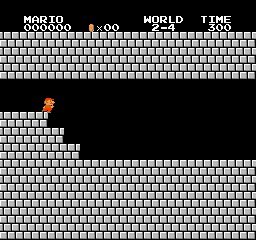
   
  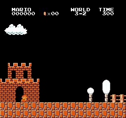
  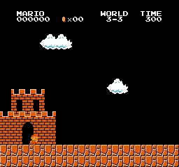
  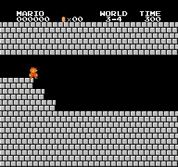
   
  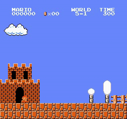
  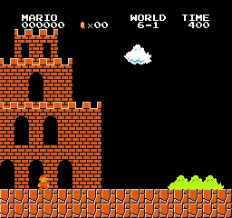
  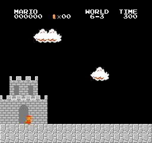
   
  
  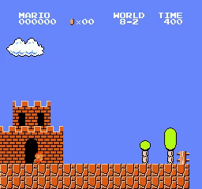
  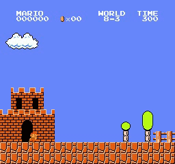 
  <i>Sample results</i>

## How to use the code
Two files to carry out the execution
* **Train your model** by running **python train.py**
* **Test your trained model** by running **python test.py**

## Requirements

* **python 3.6**
* **gym**
* **cv2**
* **pytorch** 
* **numpy**
